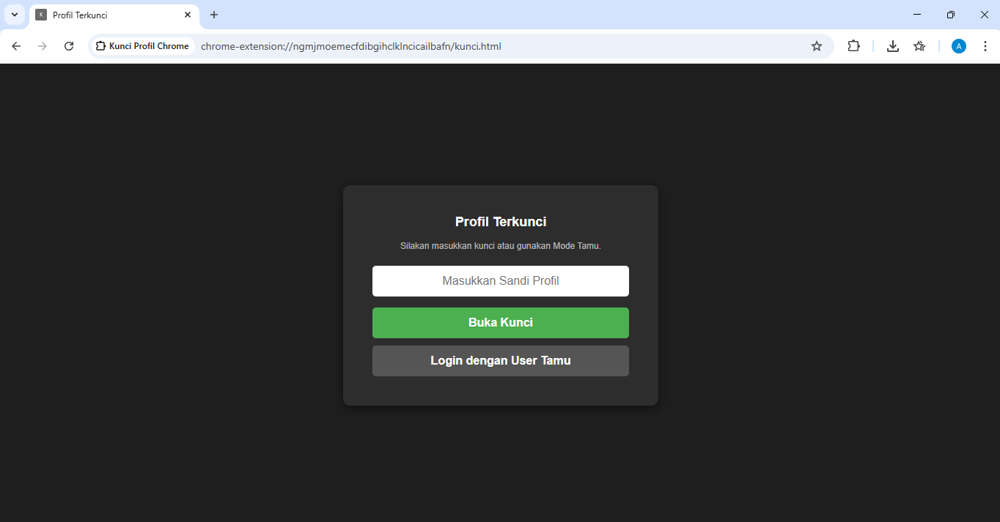
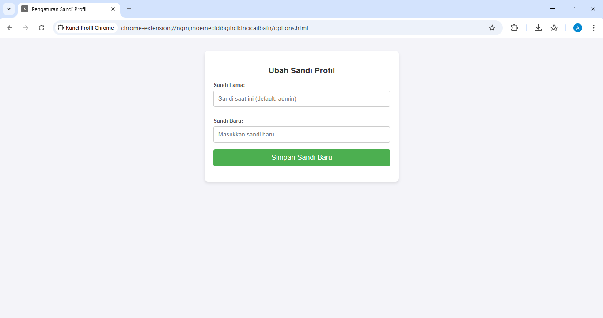

# 🔒 Kunci Profil Chrome (Chrome Profile Lock)

Ekstensi kustom Google Chrome yang berfungsi untuk mengunci layar browser dan mencegah akses tidak sah ke profil Anda. Ekstensi ini sangat berguna jika Anda sering meminjamkan laptop kepada rekan kerja atau keluarga, namun ingin menjaga privasi riwayat, *bookmark*, dan tab aktif Anda.

## ✨ Fitur Utama
* **Penguncian Otomatis:** Langsung mengunci layar setiap kali profil Chrome baru dibuka.
* **Pencegatan Tab Agresif:** Otomatis mendeteksi dan mengalihkan (*redirect*) tab baru yang coba dibuka sebelum sandi dimasukkan, mencegah *bypass* sederhana.
* **Pengaturan Sandi Kustom:** Pengguna dapat mengganti sandi bawaan melalui menu *Options* ekstensi.
* **Opsi Mode Tamu:** Menyediakan tombol instruksi ramah pengguna untuk mengarahkan peminjam menggunakan *Guest Mode* Chrome.
* **Proteksi Dasar (Anti-Inspect):** Memblokir klik kanan dan *shortcut* keyboard ke *Developer Tools* (F12, Ctrl+Shift+I) di halaman layar kunci untuk mencegah manipulasi kode dari *front-end*.

## 🚀 Cara Instalasi (Lokal / Unpacked)
Karena ekstensi ini bersifat privat dan tidak diunggah ke Chrome Web Store, Anda perlu menginstalnya secara manual (Mode Pengembang):

1. Unduh atau *clone* repositori ini ke komputer Anda.
2. Buka Google Chrome dan ketik `chrome://extensions/` di bilah alamat (*address bar*).
3. Aktifkan *toggle* **Developer mode** (Mode Pengembang) di pojok kanan atas.
4. Klik tombol **Load unpacked** (Muat yang belum dikemas) di pojok kiri atas.
5. Pilih folder tempat Anda menyimpan file ekstensi ini.
6. Ekstensi akan otomatis aktif dan mengunci layar Anda!

## 🔑 Penggunaan Dasar
* **Sandi Bawaan (Default):** `admin`
* **Cara Mengganti Sandi:** Buka `chrome://extensions/` -> Cari ekstensi ini -> Klik tombol **Details** -> Pilih **Extension options**. (Atau klik ikon ekstensi di pojok kanan atas browser dan pilih *Options*).

## ⚠️ Catatan Keamanan Tambahan
Ekstensi ini dirancang sebagai "Gembok Pagar Depan" untuk melindungi privasi dari pengguna kasual/awam. Seseorang dengan pemahaman teknis IT yang tinggi mungkin masih bisa melewati ini menggunakan fitur *Task Manager* bawaan Chrome, menonaktifkannya dari *Safe Mode*, atau memodifikasi *Local Storage*.

## 📸 Tampilan Ekstensi

**1. Tampilan Layar Kunci**

**2. Halaman Pengaturan Sandi**

---
*Dibuat untuk menjaga privasi dan kenyamanan selancar sehari-hari.*